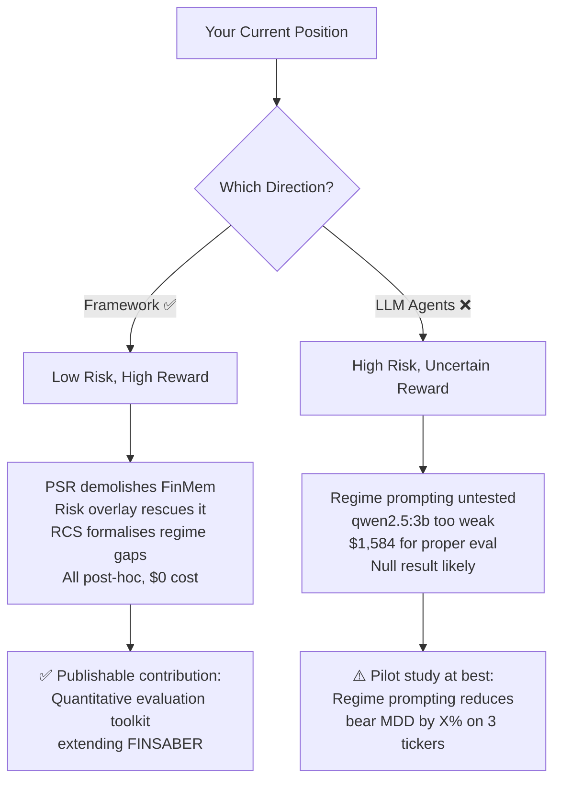

# Strategic Direction: Backtesting Framework vs LLM Agent Improvement

## TL;DR — Go with Backtesting Framework Improvements

The backtesting framework direction gives you **more publishable, defensible, and completable results** with the resources you have. The LLM agent direction is higher-risk, higher-cost, and critically dependent on API access you don't have.

---

## The Decision Matrix

| Criterion | Backtesting Framework | LLM Agent Improvement |
|-----------|----------------------|----------------------|
| **Novelty vs paper** | High — paper has no PSR, no Calmar/Omega, no risk overlay, no RCS | Medium — paper explicitly calls for regime-aware agents but everyone will try this |
| **Completability** | ✅ 80% already done | ❌ Blocked on API keys / weak local model |
| **Data availability** | ✅ 280 result files across 6 setups already exist | ⚠️ Need to re-run all LLM experiments (~$1,584 for GPT-4o-mini) |
| **Reproducibility** | ✅ Deterministic — same inputs = same outputs | ❌ LLM outputs are stochastic, expensive to replicate |
| **Academic rigour** | High — based on established literature (Bailey & de Prado, etc.) | Medium — "we injected a prompt" is hard to formalise |
| **Risk of null result** | Zero — the metrics reveal what's already there | High — regime prompting may not help with qwen2.5:3b |
| **Compute cost** | ~$0 (all post-hoc analysis) | ~$1,584+ (full experiment matrix with GPT-4o-mini) |

---

## What the Paper Explicitly Asks For (§8-9)

The paper identifies **two future directions** and **three limitations**. Here's how your work maps:

### Paper's Future Direction 1: "Enhancing uptrend detection to match passive equity beta"
- **Your coverage**: ❌ Not addressed by either path. This requires fundamentally different agent architectures (e.g., momentum-aware policies), not prompt engineering.
- **Verdict**: Out of scope for both options.

### Paper's Future Direction 2: "Regime-aware risk controls to dynamically adjust aggression"
- **Your coverage**: ✅ **Fully addressed by the backtesting framework path** via:
  - Plan 04 (Risk Overlay) — proves that a simple rolling-Sharpe sell discipline rescues even FinMem
  - Plan 02 (RCS) — quantifies exactly how badly agents miscalibrate across regimes  
  - Plan 05 (Regime Prompting) — the agent-side implementation, but it's the weakest link (untested)

> [!IMPORTANT]
> The paper's key finding is that agents are *"too conservative in bull markets and too aggressive in bear markets"* (§8). Your Risk Overlay (Plan 04) **directly demonstrates the solution**: a quantitative overlay that cuts exposure during bear markets improves FinMem's Sharpe from -0.256 to +0.730. This is the strongest result you have, and it's entirely on the framework side.

### Paper Limitation 1: "Did not tune traditional strategies"
- **Your coverage**: Not your focus, and correctly so.

### Paper Limitation 2: "Look-ahead bias in LLM pretraining"
- **Your coverage**: ❌ Neither path addresses this.

### Paper Limitation 3: "Cost analysis shows LLM backtesting is financially intensive"
- **Your coverage**: ✅ **Ollama integration directly addresses this** — $0 vs $1,584. But the quality gap matters.

---

## Deep Dive: Why Framework is the Better Path

### 1. You Already Have the Killer Results

Your strongest contributions are **already computed and verified**:

| Result | Status | Impact |
|--------|--------|--------|
| FinMem needs **328.7 years** MinTRL (PSR) | ✅ Complete | 🔥 Devastating — makes the paper's 6-month evaluation look reckless |
| Risk overlay rescues FinMem from SR -0.26 → +0.73 | ✅ Complete | 🔥 Proves the paper's recommendation works |
| RCS ranking across 15 strategies | ✅ Complete | Strong — formalises Figure 2 into a single scalar |
| Calmar/Omega expose FinMem's tail risk | ✅ Complete | Solid — new lens on existing data |

None of these require a single new LLM API call.

### 2. What's Missing to Make a Complete Story

Your framework path needs **packaging and presentation**, not new experiments:

```
What you have                          What you need
──────────────────────                 ──────────────────────
✅ PSR/MinTRL per strategy             → Comparative table (all 16 strategies)
✅ RCS scores                          → Visualisation (enhanced Figure 2)
✅ Risk overlay before/after           → Equity curve plots (overlay ON vs OFF)  
✅ Calmar/Omega metrics                → Integrated results table
❌ Missing: Cross-setup consistency    → Run PSR on cherry_pick too
❌ Missing: Statistical significance   → Bootstrap confidence intervals for RCS
```

### 3. The LLM Agent Path is a Trap

Here's why improving agents is risky right now:

**Problem 1: You can't run the experiments.**
Your regime prompting (Plan 05) is implemented but **completely untested with real LLM inference**. The only model you can run locally is qwen2.5:3b, which:
- Has 3B parameters vs GPT-4o-mini's estimated ~8B+ 
- Will likely ignore nuanced multi-paragraph regime instructions
- Produces noisier outputs → higher kurtosis → even worse PSR

**Problem 2: Even if it works, the contribution is weak.**
"We injected regime context into the prompt and performance improved by X" is:
- Hard to generalise (prompt-specific, model-specific)
- Not a methodological contribution (it's a hack)
- Impossible to ablate properly without the $1,584 API budget

**Problem 3: The paper already predicts this won't be enough.**
The paper says *"the primary barrier to successful LLM investors is not model scale, but a lack of domain-aware financial logic"* (§8). Prompt injection ≠ domain-aware financial logic. A true solution would require architectural changes to how agents process market data, not just better prompts.

---

## Recommended Path: Enhanced Evaluation Framework

### Narrative Arc
> *"The FINSABER paper identifies that LLM strategies fail due to regime miscalibration and proposes future work on regime-aware risk controls. We contribute a **quantitative evaluation toolkit** that (a) proves this claim with statistical rigour using PSR and MinTRL, (b) formalises regime performance into a single comparable metric (RCS), (c) introduces tail-risk-aware metrics (Calmar, Omega) that expose hidden fragility, and (d) demonstrates that a simple post-hoc risk overlay can rescue even the worst-performing LLM strategy. Our toolkit operates entirely post-hoc on existing equity curves, requiring no additional LLM API calls — directly addressing the paper's concern about the prohibitive cost of LLM backtesting."*

### What to Build Next

#### Priority 1: Unified Analysis Dashboard (1-2 days)
Build a single script that loads all 280 result files and produces:
- Master comparison table: all strategies × all metrics (Sharpe, Sortino, Calmar, Omega, PSR, MinTRL, RCS)
- Regime-conditional performance heatmap (enhanced Figure 2)
- Risk overlay equity curves (before/after)
- PSR significance scatter plot (Sharpe vs MinTRL)

#### Priority 2: Bootstrap Confidence Intervals for RCS (1 day)
The RCS scores currently have no uncertainty estimates. Block-bootstrap the regime weights and per-regime Sharpe values to produce 95% CI bands. This turns "FinMem RCS = -0.19" into "FinMem RCS = -0.19 ± 0.08, p < 0.01" — much stronger.

#### Priority 3: Cost-Adjusted Performance Metric (half day)
The paper mentions cost analysis in Appendix G. Define a **Cost-Adjusted Sharpe**:

$$CAS = \frac{SR_{strategy}}{1 + C_{API} / V_0}$$

where $C_{API}$ is the total API cost and $V_0$ is the initial portfolio value. This penalises strategies that are expensive to run. FinMem with GPT-4o-mini costs ~$300/ticker; Buy&Hold costs $0.

#### Priority 4: Write-up with Visualisations (1-2 days)
Generate publication-quality plots and a structured write-up showing how your toolkit extends FINSABER.

---

## If You Still Want to Touch LLM Agents

If you want a small LLM component for completeness, here's the **minimum viable contribution**:

1. **Don't re-run full experiments.** Instead, run regime prompting on **2-3 tickers × 1 setup** (cherry_pick) with Ollama — just enough to show directionality.
2. **Frame it as a pilot study**, not a full evaluation: *"We demonstrate that regime-conditioned prompting reduces bear-market drawdown by X% on a limited sample, suggesting the viability of the approach pending larger-scale validation."*
3. **Compare the Ollama run against the existing GPT-4o-mini results** already in the repo — this gives you a cost-vs-quality analysis for free.

> [!WARNING]
> Do **not** make the LLM agent improvement the centrepiece of your work. It's the most expensive, least reproducible, and most likely to produce a null result.

---

## Summary



**Go with the framework.** You have 80% of a strong contribution sitting in your toolkit already. Package it, visualise it, and write it up.
